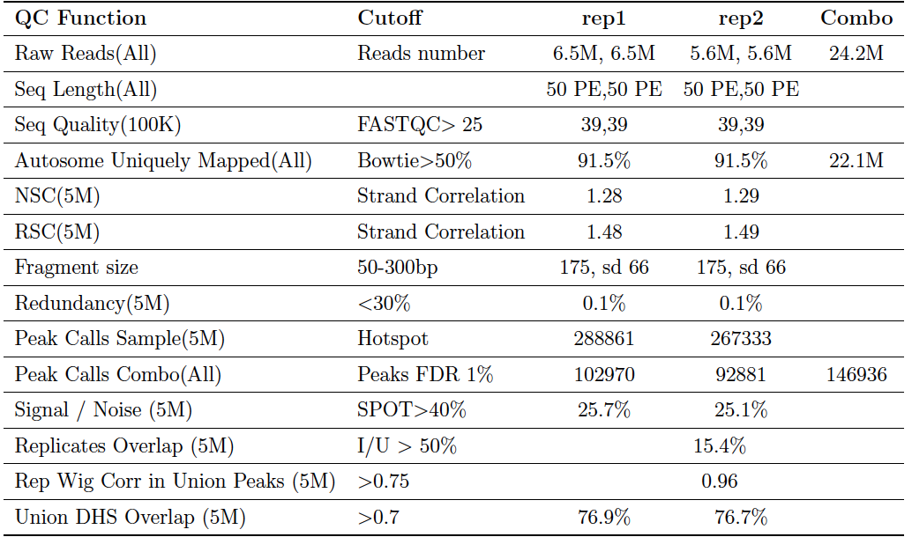

## What is GCAP
> `G`lobal `C`hromatin `A`ccessibility `P`ipeline
> 
> X-nase(Dnase, Bnase, Cnase) Quality analysis pipeline

### Installation 

NOTE:
	
	GCAP and samflow use python3
	
First, install pipeline framework: 

	
	hg clone https://bitbucket.org/hanfeisun/samflow
	python3 setup.py install
	# or
	pip-3.2 install samflow

Then, install GCAP:

    git clone https://github.com/qinqian/GCAP
    python3 setup.py install

***

The following component tools are all newest version.
In the component installation process, you could open gcap/static/GCAP_pe.conf	and modify it to fit your own machine.

##### Install FastQC
*Site* 	<http://www.bioinformatics.babraham.ac.uk/projects/fastqc/>, to keep `fastqc` in $PATH.
Info: 
	
	Per sequence quality score median is parsed from fastq text output by GCAP.
	This would be replaced by UCSC sampling tools.
	There is an option for fastqc in conf
	[fastqc]
	threads = 5 # to control cpu number
	
***

##### Install Bowtie and BWA

*Site* <http://bowtie-bio.sourceforge.net/index.shtml>

1. Add bowtie and BWA binary to $PATH 
2. download `hg19, mm9, rn4` bowtie index for library contamination evaluation, or use <http://compbio.tongji.edu.cn/~qinq/make_lib_contam_index.tar.gz> to build index. library contamination evaluation only uses bowtie.
3. For default BWA mapping, use `bwa index -a bwtsw species.fa` to build hg19, mm9 index, species.fa denote species genome sequence in fasta format.
4. use corresponding mapping tool and mapping index. e.g: 

fill in conf:    

    [tool]
    mapping = bwa
    [lib]
    genome_index = absolute_path_to_bwa_index
    or 
    [tool]
    mapping = bowtie
    [lib]
    genome_index = absolute_path_to_bowtie_index
    
    [contaminate]
	## use bowtie index to fast evaluate library purity
	hg19 = absolute_path_to_bowtie_index
	mm9 = absolute_path_to_bowtie_index
	rn4 = absolute_path_to_bowtie_index
	
***

##### Install Hotspot v4

* Hotspot default setting is used
* Download Hotspot V4 from <http://www.uwencode.org/proj/hotspot/>, get the `bowtie2minmargin.pl  chopFastaPseudoreads.pl  enumerateUniquelyMappableSpace  enumerateUniquelyMappableSpace.pl  hotspot  wavelets  wavePeaks  writeChromInfoBed.pl` into `$PATH`, you may need to compile from hotspot-deploy directory
* Download `chromInfo file` and `_MAPPABLE_FILE_` for your species and reads length(for speciel reads length, build mappable_region by enumerateUniquelyMappbleSpace) from hotspot website, fill in the `chrom_info` and `mappable_region` in hotspot section in `conf` files I mentioned below: 
* fill in the `omit` in hotspot section with Hotspot V4 built-in data Satellites BED in conf files for hg19, not available for mm9.

No matter it's SE or PE data, we take 5' tags for hotspot peaks calling.

Fill in conf:
	  
	  [tool]
	  peaks_calling = hotspot

	  [hotspot]
	  ## fill absolute path for these files
	  mappable_region = absolute path
	  chrom_info = absolute path
	  fdrs = "0.01" 
	  keep_dup = T  ## keep duplicates reads or not
	  omit = absoluate path
  

<!--NOTE on hotspot v3 output: 
	
	SPOT score is calculated by *-both-passes/*hotspot.twopass.zscore.wig
	*-both-passes/*.twopass.merge150.wgt10.zgt2.wig minimally thresholded hotspots
	*-both-passes/*.hotspot.twopass.fdr0.05.merge.[wig/bed] FDR thresholded hotspots

	take the encode 2 mouse data as an example.
	
	The following encode_mouse_treat_rep1 is the prefix.
	a.  This is top 10 of the loose hotspot regions encode_mouse_treat_rep1.hotspot.twopass.zscore.wig( totally 303941 regions ), which is used for SPOT score calculation.

	chr1    3322171 3322200 2.148710
	chr1    3346446 3346569 2.896090
	chr1    3359049 3359208 3.776190
	chr1    3360959 3361032 2.148710
	chr1    3406163 3406545 33.391200
	chr1    3406686 3406964 2.148710
	chr1    3407779 3407880 2.148710
	chr1    3412749 3412880 2.148710
	chr1    3413164 3413314 2.773560
	chr1    3415304 3415416 2.258360
	
	b. This is top 10 of `hotspot peaks` regions(Hotspot, broad peaks) encode_mouse_treat_rep1.twopass.merge150.wgt10.zgt2.wig
	so-called minimally thresholded hotspots ( totally 197552 regions )
	chr1    3322171 3322200 2.148710
	chr1    3346446 3346569 2.896090
	chr1    3359049 3359208 3.776190
	chr1    3360959 3361032 2.148710
	chr1    3406163 3406964 33.391200
	chr1    3407779 3407880 2.148710
	chr1    3412749 3412880 2.148710
	chr1    3413164 3413314 2.773560
	chr1    3415304 3415416 2.258360
	chr1    3427261 3427386 2.938350
	
	c. This  is the top ten of two passes hotspot regions with fdr 0.01 
	encode_mouse_treat_rep1.hotspot.twopass.fdr0.01.bed ( totally 162840 regions ), so called FDR thresholded hotspots.
	chr1    3406163 3406545 33.3912
	chr1    3445667 3445915 8.39721
	chr1    3467832 3468094 12.7712
	chr1    3504561 3504909 106.159
	chr1    3504916 3505327 192.588
	chr1    3505337 3505540 44.0136
	chr1    3505610 3505694 8.31948
	chr1    3541336 3541619 7.77236
	chr1    3541699 3541978 5.27296
	chr1    3542027 3542248 9.02206
	
	d. If wavelets peaks is so little that chromosome check is not True, above c will be copied to d.(Peaks, narrow peaks)
	This is the top 10 of merged wavelets peaks and hotspot regions with fdr 0.01
	encode_mouse_treat_rep1.hotspot.twopass.fdr0.01.merge.pks.bed ( totally 122532 regions, the most strict one, this is what I choose as final peaks number ), so called FDR thresholded peaks.
	chr1    3406300 3406450 .       36.406250
	chr1    3445740 3445890 .       8.953125
	chr1    3467860 3468010 .       14.734375
	chr1    3505040 3505190 .       194.953125
	chr1    3541480 3541630 .       8.593750
	chr1    3542020 3542170 .       9.250000
	chr1    3543180 3543330 .       25.515625
	chr1    3576620 3576770 .       16.453125
	chr1    3595820 3595970 .       47.406250
	chr1    3601420 3601570 .       9.750000-->
	
In hotspot v4, after `run_final` clean up	, the final results are :

	*.hot.bed           minimally thresholded hotspots( corresponding to hotspot v3 b, broad Peak)
	*.fdr0.01.hot.bed       FDR thresholded hotspots  ( corresponding to hotspot v3 c) 
	*.fdr0.01.pks.bed       FDR thresholded peaks     ( corresponding to hotspot v3 d, narrow Peak) 
	tag.density.starch  20 bp resolution, converted to bigwiggle
	macs2 bigwiggle 100 bp resolution default
	
***
	
##### install phantompeakqualtools
*site* <https://code.google.com/p/phantompeakqualtools/>

* install spp(this should be phantompeakqualtools built-in spp-*.tar.gz, use R CMD INSTALL), snow for nsc and rsc
* refer to phantompeakqualtools if necessary

fill in conf files:

	[tool]
	
	spp = absolute_path_to_phantompeakqualtools/run_spp.R
	
*** 

##### install census
*site* <https://github.com/matted/census>, see census readme for requred libraries installation, pytho2.7, scipy, pysam, numpy, setuptools. 

Default, we use 0.005 for library complexity evaluation excluded regions:

	 ./bam_to_histo.py seq.cov005.ONHG19.bed sorted.bam | ./calculate_libsize.py -
	 
census related census:

	[census]
	hist = absolute_path_to_directory_of_census/bam_to_histo.py
	calc = directory_of_census/calculate_libsize.py
	census_exclude = directory_of_census/seq.cov005.ONHG19.bed
	
*** 

##### install bedops and bedtools
* use bedtools to get peaks overlap with union DHS region
* use bedops to merge replicates peaks regions
* use bedtools to get non overlap regions(or bedops to filter blacklist)

*Site* <http://code.google.com/p/bedops/> <http://code.google.com/p/bedtools/>

*** 

##### install picard and samtools
*Site* <http://picard.sourceforge.net/index.shtml>
- Use picard SortSam.jar for conversion
- Use picard CollectInsertSizeMetrics.jar for pair end data `median fragment size` and `fragment standard deviation` evaluation.
- For single end data, we used MACS2 predictd to predict fragment size and calculate standard deviation by using MACS2 
  *predict_model.R.(this needs to be improved)

macs2 install, macs2 depends on cython and gcc: 
  
  	git clone https://github.com/taoliu/MACS/
	or 
	pip install MACS2

`Add MACS2 SPOT score calculation`

`2G` memory, `4cpu` will be used in picard Markduplicates and Insert size evaluation, `5G` memory and `4cpu` will be used for picard SortSam. If you want to use picard to sample large files to 5M, use -XX:-UseGCOverheadLimit and 4g memory setting.

fill in corresponding conf file:

	[picard]
	sort = absolute_path_to_picard/SortSam.jar
	threads = 4  ## cpu number
	insertsize = absolute_path_to_picard/CollectInsertSizeMetrics.jar
	
	[lib]
	chrom_len = absolute_path_to_chrom_len
	
you can find `chrom_len` in <http://compbio.tongji.edu.cn/~qinq/lib/gcap_data/gcap_part_data.tar.gz>, which is used for samtools conversion.
	

----

##### install UCSC component
*Site* <http://hgdownload.cse.ucsc.edu/admin/exe/linux.x86_64/>
`BedClip` is used to remove outlier chromosome locations.
`bedGraphToBigWig` is used to convert hotspot reads density files to bigwiggle.
`wigCorrelate` is used to remove outlier chromosome locations.

Replicates consistency
a. With the help of Jim, we would use `bigWigCorrelate`, it's built-in gcap/pipeline-scripts/bigWigCorrelate(added to $PATH, `bedToBigBed` is needed) for replicates consistency evaluation on union DHS regions(filted by blacklist).
b. For whole genome correlation, use `wigCorrelate`

I made a compressed package for all needed binary.
<http://compbio.tongji.edu.cn/~qinq/lib/ucsc_tools/ucsc_tools.tar.gz>

fill in conf files:
	
	[tool]
	cor = genome  ## use wigCorrelate 
	or 
	cor = union  ## use bigWigCorrelate, need to fill filtered_dhs_bb
	
	[lib]
	filtered_dhs_bb = 
	
filtered_dhs_bb is in <http://compbio.tongji.edu.cn/~qinq/lib/gcap_data/gcap_part_data.tar.gz>	

-----

#### Install latex and jinja2
Check whether `pdflatex`(pdflatex (Version 3.141592-1.21a-2.2 (Web2C 7.5.4))) is executable or not. For d
python3 module `jinja2` is a template module for rendering latex document:
	
	pip-3.2 install jinja2
	# for options
	pip-3.2 install argparse

- - - -

##### union DHS filtered by blacklist
Merged DHS from ENCODE narrow peaks(only involved in wgEncodeUwDnase* narrowPeaks from University of Washington because of their high quality) is used as reference union DHS regions. We get union DHS from +/- 150bp from narrowPeak summits, *site* <http://hgdownload.cse.ucsc.edu/goldenPath/hg19/encodeDCC/>. Please email authors to get the BED files.

*Site* <http://compbio.tongji.edu.cn/~qinq/wgEncodeDacMapabilityConsensusExcludable.bed> is the latest blacklist for human, no mouse blacklist is obtained now.

prepared union DHS (filtered by blacklist for human, no mouse blacklist available now): 

	bedops -d union_dhs.bed blacklist.bed > union_dhs_filtered.bed
	
then, convert to bigBed:

	bedToBigBed	union_dhs_filtered.bed chrom_len output.bigbed

fill in corresponding conf file:
	
	[lib]
	chrom_bed = 
	velcro =   ## blacklist
	dhs = 
	filtered_dhs_bb =  ## filling in this if you use `cor = union in tool section`
	
	
you can find `chrom_bed` in <http://compbio.tongji.edu.cn/~qinq/lib/gcap_data/gcap_part_data.tar.gz>, which is used for peaks region filtering, `velcro` for blacklist, `dhs` for DHS overlap percentage, `filtered_dhs_bb` for union DHS region correlation.

- - - -

### Usage

Three steps to use GCAP

##### 1. setup a python conf files

refer to gcap/static/GCAP_pe.conf for pair end data, gcap/static/GCAP_se.conf for single end data.
Example:
	
	[Basis]
	user = qinq
	id = sampled_pe_dnase
	species = hg19
	treat = /mnt/Storage/home/qinq/projects/GCAP/data/hansen_test_data/resampled_pair_end/HL1_LNcap_DHT_50U_50_300bp_CTTGTA_L004_R1_001.fastq.subset.6.5M, /mnt/Storage/home/qinq/projects/GCAP/data/hansen_test_data/resampled_pair_end/HL1_LNcap_DHT_50U_50_300bp_CTTGTA_L004_R2_001.fastq.subset.6.5M; /mnt/Storage/home/qinq/projects/GCAP/data/hansen_test_data/resampled_pair_end/HL1_LNcap_DHT_50U_50_300bp_CTTGTA_L004_R1_001.fastq.subset, /mnt/Storage/home/qinq/projects/GCAP/data/hansen_test_data/resampled_pair_end/HL1_LNcap_DHT_50U_50_300bp_CTTGTA_L004_R2_001.fastq.subset
	output = /mnt/Storage/home/qinq/projects/GCAP/results/pair_result_sampled/
	read_length = 50
	sequence_type = pe
	
	[tool]
	mapping = bwa
	peak_calling = hotspot
	## for strand correlation NSC, RSA
	spp = /mnt/Storage/home/qinq/projects/GCAP/codes/phantompeakqualtools/run_spp.R
	## correlation for genome or union DHS(filtered by blacklist)
	cor = genome
	#cor = union
	
	[census]
	hist = /mnt/Storage/home/qinq/projects/GCAP/codes/census/bam_to_histo.py
	calc = /mnt/Storage/home/qinq/projects/GCAP/codes/census/calculate_libsize.py
	census_exclude = /mnt/Storage/home/qinq/projects/GCAP/codes/census/seq.cov005.ONHG19.bed
	
	[picard]
	sort = /mnt/Storage/home/qinq/softwares/picard-tools-1.91/SortSam.jar
	threads = 4
	insertsize = /mnt/Storage/home/qinq/softwares/picard-tools-1.91/CollectInsertSizeMetrics.jar
	
	[lib]
	genome_index = /mnt/Storage/home/qinq/lib/hg19.fa
	## samtools view -bt chromosome length
	chrom_len = /mnt/Storage/data/Samtool/chromInfo_hg19.txt
	chrom_bed =  /mnt/Storage/home/qinq/lib/chr_limit_hg19.bed
	## union DHS filtered by bedClip to remove outlier
	dhs = /mnt/Storage/home/qinq/projects/GCAP/data/ENCODE_Peaks/hg19_filtered_dhs_clip.bed
	velcro = /mnt/Storage/home/qinq/lib/wgEncodeHg19ConsensusSignalArtifactRegions.bed
	## dhs filtered by velcro, then converted by bedToBigBed
	filtered_dhs_bb = /mnt/Storage/home/qinq/projects/GCAP/data/ENCODE_Peaks/hg19_filtered_dhs.bigbed
	
	[contaminate]
	## use bowtie index to fast evaluate library purity
	hg19 = /mnt/Storage/data/Bowtie/hg19
	mm9 = /mnt/Storage/data/Bowtie/mm9
	rn4 = /mnt/Storage/data/Bowtie/rn4_index/rn4
	
	[fastqc]
	threads = 5
	
	[bowtie]
	max_align = 1
	
	[hotspot]
	## get from http://www.uwencode.org/proj/hotspot/
	chrom_info = /mnt/Storage/home/qinq/projects/GCAP/codes/hotspot-distr-v3/data/hg19.chromInfo.bed
	mappable_region = /mnt/Storage/home/qinq/projects/GCAP/codes/hotspot-distr-v3/data/hg19.K50.mappable_only.bed
	fdrs = "0.01"
	keep_dup = T
	omit = /mnt/Storage/home/qinq/projects/GCAP/codes/hotspot-distr-v4/data/Satellite.hg19.bed
	
	[macs2]
	species = hs
	keep_dup = all
	shiftsize = 50

Instructions on the `conf` details.
`Input Format`
support fastq,bam,sam and bed files now.

Fastq Files, the most favorable input:

	in the conf files
	`sequence_type` to control sequence type:`se` or `pe`.
	
	If input is single end data, use `,` to separate replicates files.
	If input is pair end data, use `,` to separate pairs, `;` to separate replicates.
	
BAM Files, default mapped by BWA, if you're using bowtie, we recommend `-m 1` to keep uniquely mapped reads: 
	
	in the conf files, set to `bam, pe` or `bam, se`.
	Query name should be in the neighboring places.
	Original mapping results `SAM` converted by `samtools view -bt` or `picard SortSam SO=queryname` or `samtools sort -n` by query name to make sure that paired reads are in neighboring places, we could use built-in sampling or `[picard] sample` part, because GCAP built-in sampling method only support query name ordered SAM files.
	
	If you are not clear about your mapping parameter, you could try bamToFastq to convert bam to fastq and remapping through our above Fastq scheme.
	
SAM Files, original mapping results with headers , if you only have `bam` files, use `samtools view -h`, default mapped by BWA, if you're using bowtie, we recommend `-m 1` to keep uniquely mapped reads: 

	In the conf file `sequence_type` to `sam, pe` or `sam, se`, files separated by comma.
	
	If you want all SAM files have uniform mapping parameters, you could convert SAM to fastq by samtools view -bt and bamToFastq, then follow up our fastq schemes.

reads BED(converted by bedtools from BAM, sometimes GEO only preserve data with this format) or bed.starch:
     
    As our proposals is based on sampling raw reads, including mappable and unmappable reads, BED reads files(BED with 6 fields) do not have unmappable information, so this format is added only for analysis of the rest criteria. As bedToBam could only process SE bed data, PE would be regarded as SE, too. We take all BED format data as SE data, we sample down BED mappable reads 5M for comparison. Change sequence_type to `bed`. This is used for internal data comparison now.
    
    e.g.
    chr1    192388233       192388269       SOLEXA-1GA-2_0072_FC629AV:6:1:3436:1104#0/1     255     -
	chr10   43655355        43655391        SOLEXA-1GA-2_0072_FC629AV:6:1:3567:1104#0/1     255     +
	

`Remember to write your mapping and peaks calling tool.`

`Keep duplicate`
this is an important option for peaks calling. You could customize it by python conf files. To keep duplicates tags,
just `keep_dup = T` in `[hotspot]`.

`two modes of correlation`
you can choose from `[tool]` section,

* `cor = genome` for 5M reads hotspot bigwiggle genome wide correlation 
* `cor = union` for 5M reads hotspot bigwiggle ENCODE union DHS(filtered by blacklist for human) correlation.	

##### 2. dry run to make sure the installation and conf for needed files are right

* dry run
only print command line: 

	GCAP run -c conf --dry-run
	
If any files are dangling, just refer to install part or email the author.

##### 3. real run 

run with real data: 

	GCAP run -c conf

if any accident happen, debug and resume the program
resume process when problems occurs:

	GCAP run -c conf --resume

* Step control

	- skip steps:

    		GCAP run -c GCAP_pe.conf --skip 9 --resume

	- from and to:
	
		   	GCAP run -c GCAP_pe.conf --from 1 --to 3 --resume
		   	

##### after running successfully
		   	
* clean up and purge
  to remove temporary files, only keep QC report, bigwiggle, peaks, hotspot and bam files, json and latex files:
  
  		GCAP clean -c GCAP_pe.conf
  		GCAP purge -c GCAP_pe.conf
  		
##### batch mode
write a batch file `batch.conf`, which writes the path of the conf files: 
    
    	1.conf
    	2.conf
    	3.conf

the 1.conf, 2.conf, 3.conf is written up to the requirements of above conf, then run:
		
		GCAP batch -b batch.conf --resume

  
#### Tips 
`Update`: use fastqStatsAndSubsample  sampleBam implemented by Jim Kent.

<!--- We use built-in function to do raw reads sampling from PE and SE FASTQ(default) .
- Python function to sample reads from PE and SE SAM(BAM converted SAM) files， including `mappable and unmappable reads`.(default for SAM and BAM)
- picard sampling for PE and SE SAM and BAM files mappable reads. (May use many threads and memory)(optional in picard options, uncomment for default)
- MACS2 sampling for SE BAM files SE mappable reads.(not added)

We decide to use top 5M and 100k mappable and unmappable reads from PE and SE SAM files and both transfer to hospot as single end data.
-->

`samtools view -X` to see the mapping status from column 2nd, see FLAG explanation`http://picard.sourceforge.net/explain-flags.html`
If your SAM/BAM files are not original mapping results, you may need `Restoring pairing information`, this is needed for random access of raw paired reads.

##### Uniquely mapped reads
###### For BWA
use samtools to extract uniquely mapped reads
a) samtools view sample.bam | grep XT:A:U | wc -l 
	or grep XT:A:U sample.sam | wc -l
b) samtools view sample.bam | grep -v XT:A:R | wc -l ## do not exclude unmapped reads
c) samtools view -bq1 sample.bam | wc -l   ### as samtools faq told as reliable mapped <http://sourceforge.net/apps/mediawiki/samtools/index.php?title=SAM_FAQ#I_want_to_get_.60unique.27_alignments_from_SAM.2FBAM.>
TAGS XT:A:R and XT:A:U both have situations with duplicated locations, no matter their scores equal 0 or larger than 0, duplicates and unique reads all have reliable situations.

XT:A:R has 0, >1 MapQ and single or multiple locations example:
  
	HWI-ST389:264:D0VYWACXX:4:1101:1322:2155        99      chrY    2351610 0       50M     =       2351738 178     CCATGCAGCTGTTTTAATCAGCAATTCTGAGAAGACACAAATGCCCCCCG      @C@FFFFFHHHHHIIJGIIGHGHGJIIIJHHGIJJFEGJIJIIIIGGJIJ      XT:A:R  NM:i:0  SM:i:0  AM:i:0  X0:i:2  X1:i:0  XM:i:0  XO:i:0  XG:i:0  MD:Z:50 XA:Z:chrX,+2401610,50M,0;
	HWI-ST389:264:D0VYWACXX:4:1101:1322:2155        147     chrY    2351738 0       50M     =       2351610 -178    GAGCCCAGAGTGTGCGATCTGAGCTGTTTCTCAAACCAGGACAAATAAGT      HGH@>HGHCGGIGIGEDIIHDEIGIIIIIIIIIFCIIHDFDHEDAFFC@@      XT:A:R  NM:i:0  SM:i:0  AM:i:0  X0:i:2  X1:i:0  XM:i:0  XO:i:0  XG:i:0  MD:Z:50 XA:Z:chrY,-2351738,50M,0;
	## single location
	HWI-ST389:264:D0VYWACXX:4:1101:9357:2101        99      chr5    69542867        0       50M     =       69542938        121     NTGCGCACTGACTAAAGATCAGAGCAGAAAGCAGATTCTAGGAACAGTCA      #1=DDFFFHHHHHJJJJJJJJJJJJJJJJJIJIJJIJJJIJIGIJJJIJI      XT:A:R  NM:i:1  SM:i:0  AM:i:0  X0:i:4  X1:i:4  XM:i:1  XO:i:0  XG:i:0  MD:Z:0C49
	HWI-ST389:264:D0VYWACXX:4:1101:9357:2101        147     chr5    69542938        0       50M     =       69542867        -121    TCGGCATGCAACAAAATTCAAAGTAAATAGTGGTAAGGTGGGAAATGGAC      HIJIIJIJIGJJJJJJIIIIIJJIIJJIGIHJIIGJJHHHHHFFFFFC@C      XT:A:R  NM:i:0  SM:i:0  AM:i:0  X0:i:8  X1:i:1  XM:i:0  XO:i:0  XG:i:0  MD:Z:50
	## MapQ > 1
	HWI-ST389:264:D0VYWACXX:4:1101:12092:2178       99      chr11   16167025        5       50M     =       16167197        222     CAATGTTGGAAGTTCTGGCCAGGGCAATCAGGCAGGAGAAAGAAATAAAG      B@CFFFFFHHHHHJJIJJJJIJJJIJJJJGIJIJJJ?FFHJJJIJJJJJJ      XT:A:U  NM:i:0  SM:i:5  AM:i:0  X0:i:1  X1:i:70 XM:i:0  XO:i:0  XG:i:0  MD:Z:50
	HWI-ST389:264:D0VYWACXX:4:1101:12092:2178       147     chr11   16167197        5       50M     =       16167025        -222    AGTCTCAGGATACAAAATCAATGTACAAAAATCACAAGCATTCTCATACA      JIGIJJJJJIJHJJJJJJJJJJJIHJJJJJJIIHJJJHHHHHFFFFFBCC      XT:A:R  NM:i:0  SM:i:0  AM:i:0  X0:i:23 X1:i:3395       XM:i:0  XO:i:0  XG:i:0  MD:Z:50
		
XT:A:U has > 1 MapQ and one pair multiple locations example:

	HWI-ST389:264:D0VYWACXX:4:1101:6110:2188        83      chr15   66712700        33      50M     =       66712461        -289    TTTGAGACCAGCCTGGGCAACATGGCGAAACCCAGTCTCTACAAAAAGTA      JJJJJJHJJIJJJJJJJJJIJJJJJIJIHFJJJJJJJHHHHHFFFFFCCC      XT:A:U  NM:i:0  SM:i:13 AM:i:13 X0:i:1  X1:i:10 XM:i:0  XO:i:0  XG:i:0  MD:Z:50
	HWI-ST389:264:D0VYWACXX:4:1101:6110:2188        163     chr15   66712461        33      50M     =       66712700        289     		AGTCCCAGCTACTCGGGAGGCTGAGGAATGAGAATCACTTGAACCGGGGA      CCBFFFFFHHHHHJJJJJJJJJJIJJIJIJIIIJIIJIJJIJJJJJJJJ=      XT:A:U  NM:i:0  SM:i:20 AM:i:13 X0:i:1  X1:i:2  XM:i:0  XO:i:0  XG:i:0  MD:Z:50 XA:Z:chr11,-89057190,50M,1;chr2,-32834036,50M,1;

`We decide to use this to get XT:A:U tag in combination with MapQ >= 1 to get uniquely mapped reads for SE and PE`.
	
###### For bowtie
Use `-m 1` to only report uniquely mapped reads, and use shell extract autosome mapped reads.

###### sort by name
 samtools sort -n <in.bam> <byname.bam>
###### fix the mate info
 samtools sort fixmate <byname.bam> <byname.fixed.bam>
###### sort by genomic coordinate
 samtools sort <byname.fixed.bam> <out.bam>

### Prototype  Features

1. estimate per sequence quality and library contamination by using 100k sampled reads(mapping by bowtie and bwa(not added yet))
2. reads mapping(exclude mitochrondrial, X, Y mapping reads) and peaks calling on replicates all reads and 5M sampled reads(peak calling by hotspot and MACS2(added), sampling by Picard DownSampling by probability(5M/total_reads), which seems to be strange, sampling has been replaced by built-in python function, this is an option in conf file. set `picard sample path` would choose picard sampling, other situation would use built-in. Considering sampling from pair 1 for PE fastq or SE fastq files.
3. For pair end data, 5' tags from each pair will be treated as single end for hotspot v3.
4. peaks calling on combo of all reads and 5M sampled readss, Hotspot for 5M reads(broad Peak), Peaks for all reads(narrow Peak), that is, use `b, d`.
5. estimate library complexity/redundancy by 5M reads(census;picard, Markduplicates; macs2 filterdup; awk)
6. Add RSC / NSC to QC with SPOT score for 5M reads (Hotspot, a), optional: MACS2 spot score
7. estimate replicates consistency by
	1.a `wigCorrelate` for genome-wide correlation
	1.b `bigWigCorrelate` for top 5M reads BigWiggle Correlation on union DHS regions(filtered by blacklist)
	1.c BigWiggle Correlation on 5M sampled(top 5M) data union hotspot(Hotspot, b, which is filtered to remove blacklist and outlier regions) by bigwiggle(bigWigCorrelate, merged by bedops -m)
    2. Overlap by hotspot(Hotspot, b) regions overlap from 5M reads(Intersection over Union regions, bedtools)
    
8. This has been removed, calculate hotspot(filtered Hotspot, b) promotor percentage and compare with genome promotor percentage for 5M reads Hotspot(b) regions(built-in script)
9. calculate Phastcon score of top 1000 non-promotor Hotspot(filtered Hotspot, b)regions in 100 bp width around summits for 5M reads(modified cistrome built-in module)
10. estimate (narrow peaks, d) overlap with ENCODE narrow peaks union DHS on replicates of 5M reads(bedtools)

Reference
============
1. http://sourceforge.net/apps/mediawiki/srma/index.php?title=User_Guide
2. http://seqanswers.com/forums/showthread.php?t=16375
3. http://picard.sourceforge.net/explain-flags.html

----
Example
=========
- An output from GCAP

